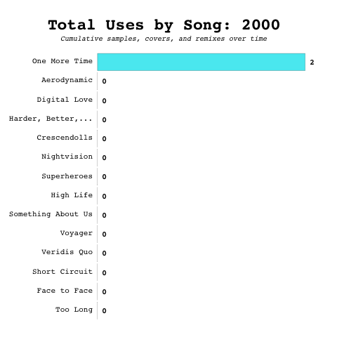
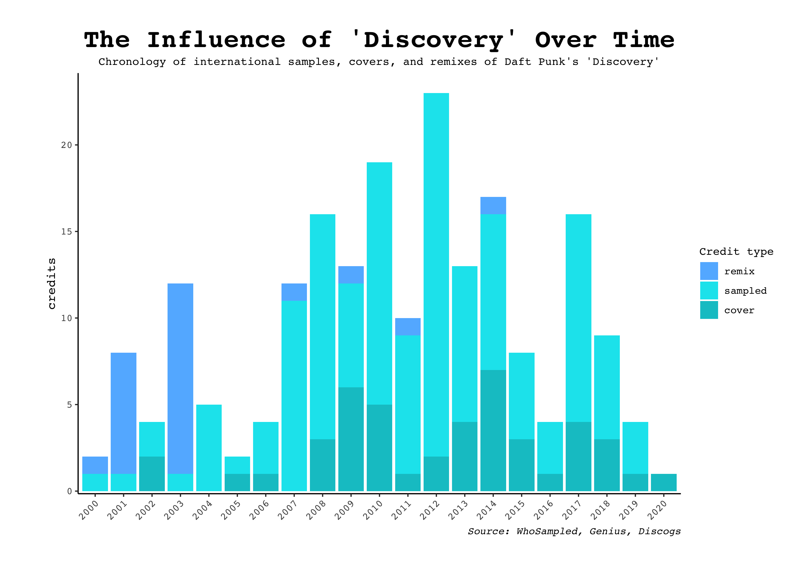
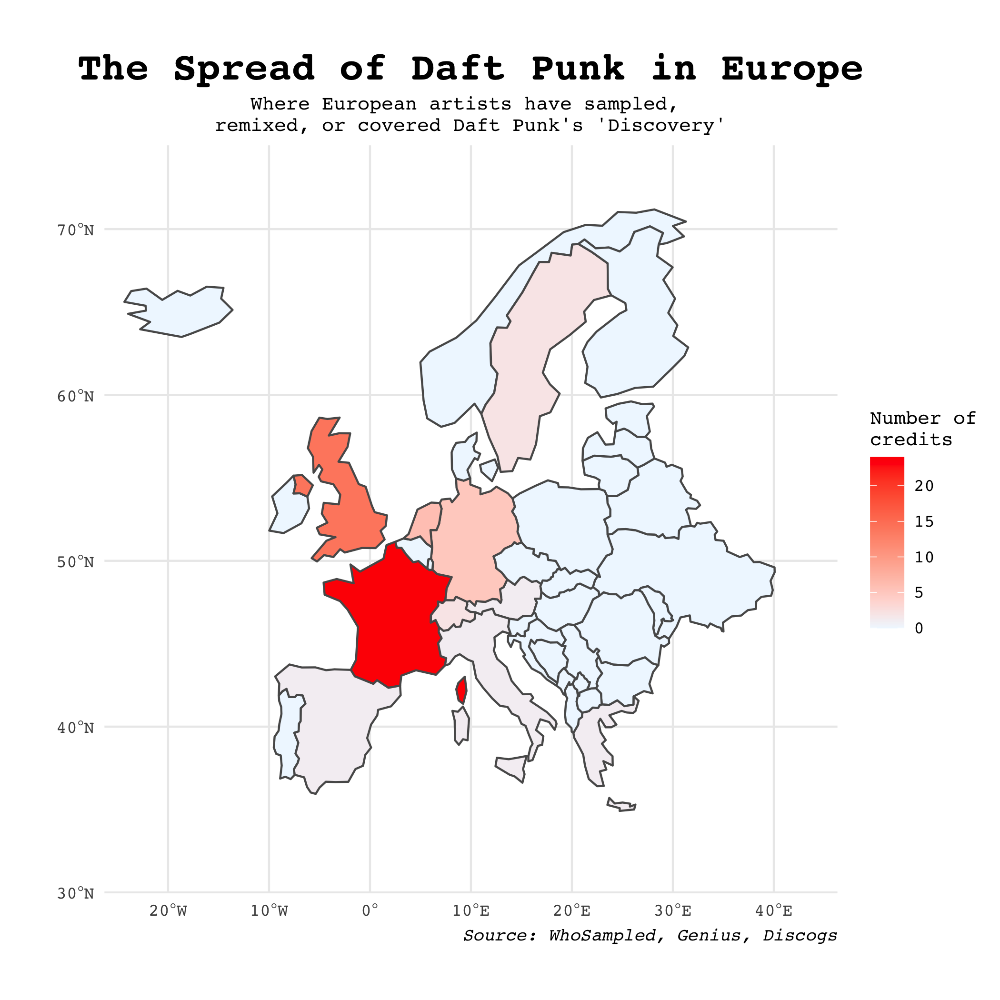

I retrieved my data from [Genius](https://genius.com/), [whosampled.com](https://whosampled.com) and [Discogs](discogs.com). The former was easy, as there are packages that make scraping simple, but the latter two were / are more difficult...

The difficulty of [whosampled.com](https://whosampled.com) comes from both the fact that it's not coder-friendly (it doesn't have an API key system, like the other two), and that its website is inconsistent. I wrote several functions to scrape the website using CSS selectors, and these functions had to include dozens of if / else statements because website URLs weren't always the same format for different sub-pages, etc. For instance, a song's samples are only listen on a separate page if there are more than 5. Also, not every song has a listed genre, and CSS selectors aren't linked to each other, so I decided to run the song titles / artists I found on whosampled through another music database...

[Discogs](discogs.com) is the largest Internet database, and I was able to find a simple package to replicate its search function. The search function prints a "discogs dataframe," which is super strange to work with. So far, I've been able to extract genres and styles for songs through it, since it's partly in list format. However, I'm still working on a method to do this for every song, and I'm looking into how I can have the code recognize when a song isn't in the Discogs database (because it simple prints a blank "discogs dataframe). 

Overall, I've made a lot of progress, and I'm very proud of it. There's still much work to do, but I'm confident that I'm working through it at a pace that will allow me to create an awesome shiny app, much like those of my inspiration for the project, [David Smale](https://davidsmale.netlify.com/portfolio/).

```{r setup, include=FALSE}
knitr::opts_chunk$set(echo = TRUE)
```

```{r, message = F, include = F}
# Initial library loading

library(tidygraph)    # filter() masked by 'tidyverse'
library(usethis)      # for setting API keys
library(knitr)
library(janitor)      # cleaning data
library(tidytext)     # helpful with 'geniusr' package
library(textdata)       # same as above
library(stringr)      # modifying character values
library(rvest)
library(shiny)
library(raster)
library(spDataLarge)
library(spData)
library(rgeos)
library(rnaturalearth)
library(rnaturalearthdata)
library(sf)
library(RCurl)        # for the function url.exists()
library(tidyverse)
library(viridis)

```

```{r, include = F}
# 'Genius'-specific packages
library(geniusr)
Sys.setenv(GENIUS_API_TOKEN = 'A629GZJinyQQJN11vDjRf_3tjx6Dsw5fpH1hdiLZwhpgABHw4yyTpm6nFQj592p8')
genius_token()

# 'Discogs'-specific packages
library(discogger)
Sys.setenv(DISCOGS_API_TOKEN = 'UqigHPcLrZSSnZuebGkYFAMdYWBWRzvtfHsgtkZK')
discogs_api_token()

# 'Spotify'-specific packages
library(spotifyr)
Sys.setenv(SPOTIFY_CLIENT_ID = '9ffd8734c372455faf4f66524809478d')
Sys.setenv(SPOTIFY_CLIENT_SECRET = 'f7d542ebdfa14c318ef9208b877ecd61')
get_spotify_access_token()

```

```{r, message = F, echo = F, include = T}
# set lexicon
bing <- get_sentiments("bing")

# scrape album tracklist
tracklist <- get_album_tracklist_search(artist_name = "Daft Punk",
                                        album_name = "Discovery")

tracklist <- tracklist[c(1, 3:4, 7, 9, 13:14),]

# scrape album lyrics
lyrics <- map_df(tracklist$song_lyrics_url, get_lyrics_url)

# counting negative / positive words
sentiment <- lyrics %>%
  unnest_tokens(word, line) %>%
  # remove stop words
  anti_join(stop_words, by = "word") %>%
  # join afinn score
  inner_join(bing, by = "word") %>%
  # count negative / positive words
  count(word, sentiment, sort = TRUE) %>%
  ungroup()

# plotting top contributors
sentiment %>%
  group_by(sentiment) %>%
  top_n(10) %>%
  ungroup() %>%
  mutate(word = reorder(word, n)) %>%
  ggplot(aes(word, n, fill = sentiment)) +
  geom_col(show.legend = FALSE) +
  facet_wrap(~sentiment, scales = "free_y") +
  labs(y = "Discovery: Words that contribute the most to positive and negative sentiment",
       x = NULL) +
  coord_flip() +
  theme_minimal()

```

```{r, echo = F, include = F}
# [B] Storing values...

# All songs, for use later...

tracklist <- c("One More Time", "Aerodynamic", "Digital Love",
               "Harder, Better, Faster, Stronger", "Crescendolls",
               "Nightvision", "Superheroes", "High Life", 
               "Something About Us", "Voyager", "Veridis Quo",
               "Short Circuit", "Face to Face", "Too Long")
samples.tab <- tibble(tracks = as.vector(tracklist))

# section header values (for functions in [C]):

samps.txt <- "Contains samples of"
sampd.txt <- "Was sampled in"
cov.txt <- "Was covered in"
rem.txt <- "Was remixed in"

```


```{r, echo = F, include = F} 
# [C]: Functions...

shnum.rename <- function(shnum, sh1, sh2, sh3, sh4){
  if(shnum == 4){
    sh.samps <- sh1
    sh.sampd <- sh2
    sh.cov <- sh3
    sh.rem <- sh4
  }else{
    if(shnum == 3){
      if(startsWith(sh1, samps.txt)){
          sh.samps <- sh1
          if(startsWith(sh2, sampd.txt)){
            sh.sampd <- sh2
            if(startsWith(sh3, cov.txt)){
              sh.cov <- sh3
              sh.rem <- NA
            }else{
              sh.cov <- NA
              sh.rem <- sh3
            }
          }else{
            sh.sampd <- NA
            sh.cov <- sh2
            sh.rem <- sh3
          }
        }else{
          sh.samps <- NA
          sh.sampd <- sh1
          sh.cov <- sh2
          sh.rem <- sh3
        }
    }else{
      if(shnum == 2){
        if(startsWith(sh1, samps.txt)){
            sh.samps <- sh1
            if(startsWith(sh2, sampd.txt)){
              sh.sampd <- sh2
              sh.cov <- NA
              sh.rem <- NA
            }else{
              if(startsWith(sh2, cov.txt)){
                sh.sampd <- NA
                sh.cov <- sh2
                sh.rem <- NA
              }else{
                sh.sampd <- NA
                sh.cov <- NA
                sh.rem <- sh2
              }
            }
          }else{
            if(startsWith(sh1, sampd.txt)){
              sh.samps <- NA
              sh.sampd <- sh1
              if(startsWith(sh2, cov.txt)){
                sh.cov <- sh2
                sh.rem <- NA
              }else{
                sh.cov <- NA
                sh.rem <- sh2
              }
            }else{
              sh.samps <- NA
              sh.sampd <- NA
              sh.cov <- sh1
              sh.rem <- sh2
            }
          }
      }else{
        if(shnum == 1){
          if(startsWith(sh1, samps.txt)){
                sh.samps <- sh1
                sh.sampd <- NA
                sh.cov <- NA
                sh.rem <- NA
              }else{
                if(startsWith(sh1, sampd.txt)){
                  sh.samps <- NA
                  sh.sampd <- sh1
                  sh.cov <- NA
                  sh.rem <- NA
                }else{
                  if(startsWith(sh1, cov.txt)){
                    sh.samps <- NA
                    sh.sampd <- NA
                    sh.cov <- sh1
                    sh.rem <- NA
                  }else{
                    sh.samps <- NA
                    sh.sampd <- NA
                    sh.cov <- NA
                    sh.rem <- sh1
                  }
                }  
              }
        }else{
            sh.samps <- NA
            sh.sampd <- NA
            sh.cov <- NA
            sh.rem <- NA
        }
      }
    }
  }
  sh.vect <- as.vector(c(sh.samps, sh.sampd, sh.cov, sh.rem))
  sh.vect
}

all.sh <- function(url){
  headers <- html_text(html_nodes(read_html(url),'.section-header-title'))
  l <- length(headers)
  if(l == 0){
    shnum <- 0
    sh1 <- "No samples"
  }else{
    if(l == 1){
      shnum <- 1
      sh1 <- headers[[1]]
      sh2 <- NA
      sh3 <- NA
      sh4 <- NA
    }else{
      if(l == 2){
        shnum <- 2
        sh1 <- headers[[1]]
        sh2 <- headers[[2]]
        sh3 <- NA
        sh4 <- NA
      }else{
        if(l == 3){
          shnum <- 3
          sh1 <- headers[[1]]
          sh2 <- headers[[2]]
          sh3 <- headers[[3]]
          sh4 <- NA
        }else{
          shnum <- 4
          sh1 <- headers[[1]]
          sh2 <- headers[[2]]
          sh3 <- headers[[3]]
          sh4 <- headers[[4]]
        }
      }
    }
  }
  shnum.rename(shnum, sh1 = sh1, sh2 = sh2, sh3 = sh3, sh4 = sh4)
}

numextract <- function(string){ 
  str_extract(string, "\\-*\\d+\\.*\\d*")
}

samp.tibble <- function(artist, song){
  artist.mod <- gsub("'", "%27", artist)
  song.mod <- gsub("'", "%27", song)
  song.mod <- gsub(":", "%3A", song)
  url <- paste0("https://www.whosampled.com/", gsub(" ", "-", artist.mod, fixed = T),"/", 
                gsub(" ", "-", song.mod, fixed = T))
  if(!url.exists(url)){
    artist.mod <- gsub(" and.*", "", artist.mod)
    url <- paste0("https://www.whosampled.com/", gsub(" ", "-", artist.mod, fixed = T),"/", 
                gsub(" ", "-", song.mod, fixed = T))
  }
  if(!url.exists(url)){
    artist.mod <- gsub("/ ", "", artist.mod)
    song.mod <- gsub("/ ", "", song.mod)
    song.mod <- gsub("/", "", song.mod)
    url <- paste0("https://www.whosampled.com/", gsub(" ", "-", artist.mod, fixed = T),"/", 
                gsub(" ", "-", song.mod, fixed = T))
  }
  samp.vect <- all.sh(url)
  samp.tibble <- tibble(type = c("Samples", "Sampled", "Covers", "Remixes"),
                        number = as.numeric(numextract(samp.vect)))
  samp.tibble
}

get.samps <- function(artist, song){
  samp.tib <- samp.tibble(artist, song)
  samp.tib <- samp.tib %>% replace_na(list(number = 0))
  artist.mod <- gsub("'", "%27", artist)
  song.mod <- gsub("'", "%27", song)
  song.mod <- gsub(":", "%3A", song)
  url <- paste0("https://www.whosampled.com/", gsub(" ", "-", artist.mod, fixed = T),"/", 
                gsub(" ", "-", song.mod, fixed = T))
  if(!url.exists(url)){
    artist.mod <- gsub(" and.*", "", artist.mod)
    url <- paste0("https://www.whosampled.com/", gsub(" ", "-", artist.mod, fixed = T),"/", 
                gsub(" ", "-", song.mod, fixed = T))
  }
  if(!url.exists(url)){
    artist.mod <- gsub("/ ", "", artist.mod)
    song.mod <- gsub("/ ", "", song.mod)
    song.mod <- gsub("/", "", song.mod)
    url <- paste0("https://www.whosampled.com/", gsub(" ", "-", artist.mod, fixed = T),"/", 
                gsub(" ", "-", song.mod, fixed = T))
  }
  if(pull(samp.tib[1, 2]) == 0){
    samps <- NA
  }else{ 
    if(pull(samp.tib[1, 2]) <= 5){
      n1 <- pull(samp.tib[1, 2])
      samps <- tibble(track = as.vector(html_text(html_nodes(read_html(url),'.playIcon')))[1:n1], 
                      artist = as.vector(html_text(html_nodes(read_html(url),'.trackArtist')))[1:n1])
    }else{
      if(ceiling(pull(samp.tib[1, 2]) / 16) == 1){
        url1 <- paste0(url, "/samples/", "?cp=", "1")
        samps <- tibble(track = as.vector(html_text(html_nodes(read_html(url1),'.playIcon'))), 
                        artist = as.vector(html_text(html_nodes(read_html(url1),'.trackArtist'))))
      }else{
        if(ceiling(pull(samp.tib[1, 2]) / 16) == 2){
          url1 <- paste0(url, "/samples/", "?cp=", "1")
          samps <- tibble(track = as.vector(html_text(html_nodes(read_html(url1),'.playIcon'))), 
                          artist = as.vector(html_text(html_nodes(read_html(url1),'.trackArtist'))))
          url2 <- paste0(url, "/samples/", "?cp=", "2")
          samps <- add_row(samps, track = as.vector(html_text(html_nodes(read_html(url2),'.playIcon'))),
                          artist = as.vector(html_text(html_nodes(read_html(url2),'.trackArtist'))))
        }else{
          if(ceiling(pull(samp.tib[1, 2]) / 16) == 3){
            url1 <- paste0(url, "/samples/", "?cp=", "1")
            samps <- tibble(track = as.vector(html_text(html_nodes(read_html(url1),'.playIcon'))), 
                            artist = as.vector(html_text(html_nodes(read_html(url1),'.trackArtist'))))  
            url2 <- paste0(url, "/samples/", "?cp=", "2")
            samps <- add_row(samps, track = as.vector(html_text(html_nodes(read_html(url2),'.playIcon'))),
                            artist = as.vector(html_text(html_nodes(read_html(url2),'.trackArtist'))))
            url3 <- paste0(url, "/samples/", "?cp=", "3")
            samps <- add_row(samps, track = as.vector(html_text(html_nodes(read_html(url3),'.playIcon'))),
                            artist = as.vector(html_text(html_nodes(read_html(url3),'.trackArtist'))))
          }else{
            if(ceiling(pull(samp.tib[1, 2]) / 16) == 4){
              url1 <- paste0(url, "/samples/", "?cp=", "1")
              samps <- tibble(track = as.vector(html_text(html_nodes(read_html(url1),'.playIcon'))), 
                              artist = as.vector(html_text(html_nodes(read_html(url1),'.trackArtist'))))
              url2 <- paste0(url, "/samples/", "?cp=", "2")
              samps <- add_row(samps, track = as.vector(html_text(html_nodes(read_html(url2),'.playIcon'))),
                              artist = as.vector(html_text(html_nodes(read_html(url2),'.trackArtist'))))
              url3 <- paste0(url, "/samples/", "?cp=", "3")
              samps <- add_row(samps, track = as.vector(html_text(html_nodes(read_html(url3),'.playIcon'))),
                              artist = as.vector(html_text(html_nodes(read_html(url3),'.trackArtist'))))
              url4 <- paste0(url, "/samples/", "?cp=", "4")
              samps <- add_row(samps, track = as.vector(html_text(html_nodes(read_html(url4),'.playIcon'))),
                              artist = as.vector(html_text(html_nodes(read_html(url4),'.trackArtist'))))
            }else{
              print("more than 4 pages...")
            }
          }
        }
      }
    }
  }
  if(!is.tibble(samps)){
    samps
  }else{
    samps <- samps %>%
      mutate(artist = gsub("\n\t\t\t", "", artist, fixed = T),
             artist = sub("by ", "", artist, fixed = T),
             year = str_sub(artist,-6,-1),
             year = as.numeric(str_sub(year, 2, 5)),
             artist = str_sub(artist, 0, nchar(artist) - 7)) %>% 
      mutate(artist = gsub("feat.*","",artist)) %>% 
      mutate(type = "samples")
    samps
  }
}

get.sampd <- function(artist, song){
  samp.tib <- samp.tibble(artist, song)
  samp.tib <- samp.tib %>% replace_na(list(number = 0))
  artist.mod <- gsub("'", "%27", artist)
  song.mod <- gsub("'", "%27", song)
  song.mod <- gsub(":", "%3A", song)
  url <- paste0("https://www.whosampled.com/", gsub(" ", "-", artist.mod, fixed = T),"/", 
                gsub(" ", "-", song.mod, fixed = T))
  if(!url.exists(url)){
    artist.mod <- gsub(" and.*", "", artist.mod)
    url <- paste0("https://www.whosampled.com/", gsub(" ", "-", artist.mod, fixed = T),"/", 
                gsub(" ", "-", song.mod, fixed = T))
  }
  if(!url.exists(url)){
    artist.mod <- gsub("/ ", "", artist.mod)
    song.mod <- gsub("/ ", "", song.mod)
    song.mod <- gsub("/", "", song.mod)
    url <- paste0("https://www.whosampled.com/", gsub(" ", "-", artist.mod, fixed = T),"/", 
                gsub(" ", "-", song.mod, fixed = T))
  }
  
  if(pull(samp.tib[2, 2]) == 0){
    sampd <- NA
  }else{ 
    if(pull(samp.tib[2, 2]) <= 5){
      n1 <- ifelse(pull(samp.tib[1, 2]) >= 5, 6, pull(samp.tib[1, 2]) + 1)
      n2 <- n1 + pull(samp.tib[2, 2]) - 1
      sampd <- tibble(track = as.vector(html_text(html_nodes(read_html(url),'.playIcon')))[n1:n2], 
                      artist = as.vector(html_text(html_nodes(read_html(url),'.trackArtist')))[n1:n2])
    }else{
      if(ceiling(pull(samp.tib[2, 2]) / 16) == 1){
        url1 <- paste0(url, "/sampled/", "?cp=", "1")
        sampd <- tibble(track = as.vector(html_text(html_nodes(read_html(url1),'.playIcon'))), 
                        artist = as.vector(html_text(html_nodes(read_html(url1),'.trackArtist'))))
      }else{
        if(ceiling(pull(samp.tib[2, 2]) / 16) == 2){
          url1 <- paste0(url, "/sampled/", "?cp=", "1")
          sampd <- tibble(track = as.vector(html_text(html_nodes(read_html(url1),'.playIcon'))), 
                          artist = as.vector(html_text(html_nodes(read_html(url1),'.trackArtist'))))
          url2 <- paste0(url, "/sampled/", "?cp=", "2")
          sampd <- add_row(sampd, track = as.vector(html_text(html_nodes(read_html(url2),'.playIcon'))),
                          artist = as.vector(html_text(html_nodes(read_html(url2),'.trackArtist'))))
        }else{
          if(ceiling(pull(samp.tib[2, 2]) / 16) == 3){
            url1 <- paste0(url, "/sampled/", "?cp=", "1")
            sampd <- tibble(track = as.vector(html_text(html_nodes(read_html(url1),'.playIcon'))), 
                            artist = as.vector(html_text(html_nodes(read_html(url1),'.trackArtist'))))  
            url2 <- paste0(url, "/sampled/", "?cp=", "2")
            sampd <- add_row(sampd, track = as.vector(html_text(html_nodes(read_html(url2),'.playIcon'))),
                            artist = as.vector(html_text(html_nodes(read_html(url2),'.trackArtist'))))
            url3 <- paste0(url, "/sampled/", "?cp=", "3")
            sampd <- add_row(sampd, track = as.vector(html_text(html_nodes(read_html(url3),'.playIcon'))),
                            artist = as.vector(html_text(html_nodes(read_html(url3),'.trackArtist'))))
          }else{
            if(ceiling(pull(samp.tib[2, 2]) / 16) == 4){
              url1 <- paste0(url, "/sampled/", "?cp=", "1")
              sampd <- tibble(track = as.vector(html_text(html_nodes(read_html(url1),'.playIcon'))), 
                              artist = as.vector(html_text(html_nodes(read_html(url1),'.trackArtist'))))
              url2 <- paste0(url, "/sampled/", "?cp=", "2")
              sampd <- add_row(sampd, track = as.vector(html_text(html_nodes(read_html(url2),'.playIcon'))),
                              artist = as.vector(html_text(html_nodes(read_html(url2),'.trackArtist'))))
              url3 <- paste0(url, "/sampled/", "?cp=", "3")
              sampd <- add_row(sampd, track = as.vector(html_text(html_nodes(read_html(url3),'.playIcon'))),
                              artist = as.vector(html_text(html_nodes(read_html(url3),'.trackArtist'))))
              url4 <- paste0(url, "/sampled/", "?cp=", "4")
              sampd <- add_row(sampd, track = as.vector(html_text(html_nodes(read_html(url4),'.playIcon'))),
                              artist = as.vector(html_text(html_nodes(read_html(url4),'.trackArtist'))))
            }else{
              print("more than 4 pages...")
            }
          }
        }
      }
    }
  }
  if(!is.tibble(sampd)){
    sampd
  }else{
    sampd <- sampd %>%
      mutate(artist = gsub("\n\t\t\t", "", artist, fixed = T),
             artist = sub("by ", "", artist, fixed = T),
             year = str_sub(artist,-6,-1),
             year = as.numeric(str_sub(year, 2, 5)),
             artist = str_sub(artist, 0, nchar(artist) - 7)) %>% 
      mutate(artist = gsub("feat.*","",artist)) %>% 
      mutate(type = "sampled")
    sampd
  }
}

get.cov <- function(artist, song){
  samp.tib <- samp.tibble(artist, song)
  samp.tib <- samp.tib %>% replace_na(list(number = 0))
  artist.mod <- gsub("'", "%27", artist)
  song.mod <- gsub("'", "%27", song)
  song.mod <- gsub(":", "%3A", song)
  url <- paste0("https://www.whosampled.com/", gsub(" ", "-", artist.mod, fixed = T),"/", 
                gsub(" ", "-", song.mod, fixed = T))
  if(!url.exists(url)){
    artist.mod <- gsub(" and.*", "", artist.mod)
    url <- paste0("https://www.whosampled.com/", gsub(" ", "-", artist.mod, fixed = T),"/", 
                gsub(" ", "-", song.mod, fixed = T))
  }
  if(!url.exists(url)){
    artist.mod <- gsub("/ ", "", artist.mod)
    song.mod <- gsub("/ ", "", song.mod)
    song.mod <- gsub("/", "", song.mod)
    url <- paste0("https://www.whosampled.com/", gsub(" ", "-", artist.mod, fixed = T),"/", 
                gsub(" ", "-", song.mod, fixed = T))
  }
  if(pull(samp.tib[3, 2]) == 0){
    cov <- NA
  }else{ 
    if(pull(samp.tib[3, 2]) <= 5){
      n1 <- ifelse(pull(samp.tib[1, 2]) >= 5, 5, pull(samp.tib[1, 2])) + 
            ifelse(pull(samp.tib[2, 2]) >= 5, 6, pull(samp.tib[2, 2]) + 1)
      n2 <- n1 + pull(samp.tib[3, 2]) - 1
      cov <- tibble(track = as.vector(html_text(html_nodes(read_html(url),'.playIcon')))[n1:n2], 
                      artist = as.vector(html_text(html_nodes(read_html(url),'.trackArtist')))[n1:n2])
    }else{
      if(ceiling(pull(samp.tib[3, 2]) / 16) == 1){
        url1 <- paste0(url, "/covered/", "?cp=", "1")
        cov <- tibble(track = as.vector(html_text(html_nodes(read_html(url1),'.playIcon'))), 
                        artist = as.vector(html_text(html_nodes(read_html(url1),'.trackArtist'))))
      }else{
        if(ceiling(pull(samp.tib[3, 2]) / 16) == 2){
          url1 <- paste0(url, "/covered/", "?cp=", "1")
          cov <- tibble(track = as.vector(html_text(html_nodes(read_html(url1),'.playIcon'))), 
                          artist = as.vector(html_text(html_nodes(read_html(url1),'.trackArtist'))))
          url2 <- paste0(url, "/covered/", "?cp=", "2")
          cov <- add_row(cov, track = as.vector(html_text(html_nodes(read_html(url2),'.playIcon'))),
                          artist = as.vector(html_text(html_nodes(read_html(url2),'.trackArtist'))))
        }else{
          if(ceiling(pull(samp.tib[3, 2]) / 16) == 3){
            url1 <- paste0(url, "/covered/", "?cp=", "1")
            cov <- tibble(track = as.vector(html_text(html_nodes(read_html(url1),'.playIcon'))), 
                            artist = as.vector(html_text(html_nodes(read_html(url1),'.trackArtist'))))  
            url2 <- paste0(url, "/covered/", "?cp=", "2")
            cov <- add_row(cov, track = as.vector(html_text(html_nodes(read_html(url2),'.playIcon'))),
                            artist = as.vector(html_text(html_nodes(read_html(url2),'.trackArtist'))))
            url3 <- paste0(url, "/covered/", "?cp=", "3")
            cov <- add_row(cov, track = as.vector(html_text(html_nodes(read_html(url3),'.playIcon'))),
                            artist = as.vector(html_text(html_nodes(read_html(url3),'.trackArtist'))))
          }else{
            if(ceiling(pull(samp.tib[3, 2]) / 16) == 4){
              url1 <- paste0(url, "/covered/", "?cp=", "1")
              cov <- tibble(track = as.vector(html_text(html_nodes(read_html(url1),'.playIcon'))), 
                              artist = as.vector(html_text(html_nodes(read_html(url1),'.trackArtist'))))
              url2 <- paste0(url, "/covered/", "?cp=", "2")
              cov <- add_row(cov, track = as.vector(html_text(html_nodes(read_html(url2),'.playIcon'))),
                              artist = as.vector(html_text(html_nodes(read_html(url2),'.trackArtist'))))
              url3 <- paste0(url, "/covered/", "?cp=", "3")
              cov <- add_row(cov, track = as.vector(html_text(html_nodes(read_html(url3),'.playIcon'))),
                              artist = as.vector(html_text(html_nodes(read_html(url3),'.trackArtist'))))
              url4 <- paste0(url, "/covered/", "?cp=", "4")
              cov <- add_row(cov, track = as.vector(html_text(html_nodes(read_html(url4),'.playIcon'))),
                              artist = as.vector(html_text(html_nodes(read_html(url4),'.trackArtist'))))
            }else{
              print("more than 4 pages...")
            }
          }
        }
      }
    }
  }
  if(!is.tibble(cov)){
    cov
  }else{
    cov <- cov %>%
      mutate(artist = gsub("\n\t\t\t", "", artist, fixed = T),
             artist = sub("by ", "", artist, fixed = T),
             year = str_sub(artist,-6,-1),
             year = as.numeric(str_sub(year, 2, 5)),
             artist = str_sub(artist, 0, nchar(artist) - 7)) %>% 
      mutate(artist = gsub("feat.*","",artist)) %>% 
      mutate(type = "cover")
    cov
  }
}

get.rem <- function(artist, song){
  samp.tib <- samp.tibble(artist, song)
  samp.tib <- samp.tib %>% replace_na(list(number = 0))
  artist.mod <- gsub("'", "%27", artist)
  song.mod <- gsub("'", "%27", song)
  song.mod <- gsub(":", "%3A", song)
  url <- paste0("https://www.whosampled.com/", gsub(" ", "-", artist.mod, fixed = T),"/", 
                gsub(" ", "-", song.mod, fixed = T))
  if(!url.exists(url)){
    artist.mod <- gsub(" and.*", "", artist.mod)
    url <- paste0("https://www.whosampled.com/", gsub(" ", "-", artist.mod, fixed = T),"/", 
                gsub(" ", "-", song.mod, fixed = T))
  }
  if(!url.exists(url)){
    artist.mod <- gsub("/ ", "", artist.mod)
    song.mod <- gsub("/ ", "", song.mod)
    song.mod <- gsub("/", "", song.mod)
    url <- paste0("https://www.whosampled.com/", gsub(" ", "-", artist.mod, fixed = T),"/", 
                gsub(" ", "-", song.mod, fixed = T))
  }
  if(pull(samp.tib[4, 2]) == 0){
    rem <- NA
  }else{ 
    if(pull(samp.tib[4, 2]) <= 5){
      n1 <- ifelse(pull(samp.tib[1, 2]) >= 5, 5, pull(samp.tib[1, 2])) + 
            ifelse(pull(samp.tib[2, 2]) >= 5, 5, pull(samp.tib[2, 2])) +
            ifelse(pull(samp.tib[3, 2]) >= 5, 6, pull(samp.tib[3, 2]) + 1)
      n2 <- n1 + pull(samp.tib[4, 2]) - 1
      rem <- tibble(track = as.vector(html_text(html_nodes(read_html(url),'.playIcon')))[n1:n2], 
                      artist = as.vector(html_text(html_nodes(read_html(url),'.trackArtist')))[n1:n2])
    }else{
      if(ceiling(pull(samp.tib[4, 2]) / 16) == 1){
        url1 <- paste0(url, "/remixed/", "?cp=", "1")
        rem <- tibble(track = as.vector(html_text(html_nodes(read_html(url1),'.playIcon'))), 
                        artist = as.vector(html_text(html_nodes(read_html(url1),'.trackArtist'))))
      }else{
        if(ceiling(pull(samp.tib[4, 2]) / 16) == 2){
          url1 <- paste0(url, "/remixed/", "?cp=", "1")
          rem <- tibble(track = as.vector(html_text(html_nodes(read_html(url1),'.playIcon'))), 
                          artist = as.vector(html_text(html_nodes(read_html(url1),'.trackArtist'))))
          url2 <- paste0(url, "/remixed/", "?cp=", "2")
          rem <- add_row(rem, track = as.vector(html_text(html_nodes(read_html(url2),'.playIcon'))),
                          artist = as.vector(html_text(html_nodes(read_html(url2),'.trackArtist'))))
        }else{
          if(ceiling(pull(samp.tib[4, 2]) / 16) == 3){
            url1 <- paste0(url, "/remixed/", "?cp=", "1")
            rem <- tibble(track = as.vector(html_text(html_nodes(read_html(url1),'.playIcon'))), 
                            artist = as.vector(html_text(html_nodes(read_html(url1),'.trackArtist'))))  
            url2 <- paste0(url, "/remixed/", "?cp=", "2")
            rem <- add_row(rem, track = as.vector(html_text(html_nodes(read_html(url2),'.playIcon'))),
                            artist = as.vector(html_text(html_nodes(read_html(url2),'.trackArtist'))))
            url3 <- paste0(url, "/remixed/", "?cp=", "3")
            rem <- add_row(rem, track = as.vector(html_text(html_nodes(read_html(url3),'.playIcon'))),
                            artist = as.vector(html_text(html_nodes(read_html(url3),'.trackArtist'))))
          }else{
            if(ceiling(pull(samp.tib[4, 2]) / 16) == 4){
              url1 <- paste0(url, "/remixed/", "?cp=", "1")
              rem <- tibble(track = as.vector(html_text(html_nodes(read_html(url1),'.playIcon'))), 
                              artist = as.vector(html_text(html_nodes(read_html(url1),'.trackArtist'))))
              url2 <- paste0(url, "/remixed/", "?cp=", "2")
              rem <- add_row(rem, track = as.vector(html_text(html_nodes(read_html(url2),'.playIcon'))),
                              artist = as.vector(html_text(html_nodes(read_html(url2),'.trackArtist'))))
              url3 <- paste0(url, "/remixed/", "?cp=", "3")
              rem <- add_row(rem, track = as.vector(html_text(html_nodes(read_html(url3),'.playIcon'))),
                              artist = as.vector(html_text(html_nodes(read_html(url3),'.trackArtist'))))
              url4 <- paste0(url, "/remixed/", "?cp=", "4")
              rem <- add_row(rem, track = as.vector(html_text(html_nodes(read_html(url4),'.playIcon'))),
                              artist = as.vector(html_text(html_nodes(read_html(url4),'.trackArtist'))))
            }else{
              print("more than 4 pages...")
            }
          }
        }
      }
    }
  }
  if(!is.tibble(rem)){
    rem
  }else{
    rem <- rem %>%
      mutate(artist = gsub("\n\t\t\t", "", artist, fixed = T),
             artist = sub("by ", "", artist, fixed = T),
             year = str_sub(artist,-6,-1),
             year = as.numeric(str_sub(year, 2, 5)),
             artist = str_sub(artist, 0, nchar(artist) - 7))  %>% 
      mutate(artist = gsub("feat.*","",artist)) %>% 
      mutate(type = "remix")
    rem
  }
}

all.rel <- function(artist, song){
  s1 <- get.samps(artist, song) 
  s2 <- get.sampd(artist, song)
  s3 <- get.cov(artist, song)
  s4 <- get.rem(artist, song)

  all.tib <- tibble(track = c("filler"), artist = c("filler"), year = c("filler"), type = c("filler")) 
  all.tib <- if(is.tibble(s1)){rbind(all.tib, s1)}else{all.tib}
  all.tib <- if(is.tibble(s2)){rbind(all.tib, s2)}else{all.tib}
  all.tib <- if(is.tibble(s3)){rbind(all.tib, s3)}else{all.tib}
  all.tib <- if(is.tibble(s4)){rbind(all.tib, s4)}else{all.tib}
  
  all.tib %>% filter(!track == "filler")
    
}

all.rel.album <- function(artist, album) {
  tracklist <- get_album_tracklist_search(artist_name = artist,
                                          album_name = album) %>% 
               select(song_number, song_title) %>% 
               rename(track.num = song_number,
                      song = song_title) %>% 
               mutate(main.artist = artist)
  
  all.rel.album.tib <- map2_dfr(as.vector(tracklist$main.artist), 
                                     as.vector(tracklist$song),
                                     ~all.rel(artist = .x,
                                              song = .y))
  all.rel.album.tib
}

is.discogs.error <- function(x){
  tryCatch({x},
           warning = function(w){FALSE},
           error = function(e){TRUE},
           finally = 
           ) 
}

discogs_info.tib <- function(artist, song){
  result <- 
    ifelse(!is.list(is.discogs.error(discogs_search(list(track = song, artist = artist), n_results = 1))),
           ifelse(!is.list(is.discogs.error(discogs_search(list(track = song), n_results = 1))), 
                  NA, discogs_search(list(track = song), n_results = 1)),  
           ifelse(length(discogs_search(list(track = song, artist = artist), n_results = 1)[[1]]) > 0,
                  discogs_search(list(track = song, artist = artist), n_results = 1),
           ifelse(length(discogs_search(list(track = song, artist = gsub("and.*","",artist)), n_results = 1)[[1]]) > 0,
                  discogs_search(list(track = song, artist = gsub("and.*","",artist)), n_results = 1),
                  NA)))
  tibble(song = song,
         artist = artist,
         style = ifelse(is.na(result), NA, result[[1]]$style),
         country = ifelse(is.na(result), NA, unlist(result[[1]]$country)),
         genre = ifelse(is.na(result), NA, result[[1]]$genre))
}

all.rel.song.info <- function(artist, song){
  all.rell.song <- all.rel(artist, song) %>% mutate(main.song = song)
  types.col <- all.rell.song %>% select(type)
  
  all.rel.song.info.tib <- map2_dfr(as.vector(all.rell.song$artist), 
                                    as.vector(all.rell.song$track), ~discogs_info.tib(artist = .x, 
                                                                                      song = .y)) %>% 
                           cbind(types.col) %>% 
                           mutate(main.song = all.rell.song$main.song)
  all.rel.song.info.tib
}

all.rel.album.info <- function(artist, album){
  tracklist <- get_album_tracklist_search(artist_name = artist,
                                          album_name = album) %>% 
               select(song_number, song_title) %>% 
               rename(track.num = song_number,
                      song = song_title) %>% 
               mutate(main.artist = artist)
  
  all.rel.album.info.tib <- map2_dfr(as.vector(tracklist$main.artist), 
                                     as.vector(tracklist$song),
                                     ~all.rel.song.info(artist = .x,
                                                        song = .y))
  all.rel.album.info.tib
}  

```

```{r, eval = F}
# Example of intermediate and Discogs functions I've written:

artist <- "Daft Punk"
song <- "One More Time"

x <- get.samps(artist, song)
x

info <- discogs_info.tib(pull(x[1,2]), pull(x[1,1]))
info

genres <- unlist(info$genre)
genres

```

```{r, eval = F}
# This is essentially how I collected the data I've been using

all.rel.album.info(artist = "Daft Punk", album = "Discovery") %>% 
  inner_join(all.rel.album("Daft Punk", "Discovery"), by = c("artist", "type", c("song" = "track"))) %>%
  saveRDS(file = "discovering_discovery/scraped_data/discogs_samp_data.RDS")

```

```{r, eval = T}
# Run this code chunk to access above data

data.main <- readRDS("discovering_discovery/scraped_data/discogs_samp_data.RDS")

```

```{r}
# Functions solely for "sampled" songs (and songs that sampled them...)

just.sampd <- function(artist, song){
  sampd <- get.sampd(artist, song)

  all.tib <- tibble(track = c("filler"), artist = c("filler"), year = c("filler"), type = c("filler")) 
  all.tib <- if(is.tibble(sampd)){rbind(all.tib, sampd)}else{all.tib}
  
  all.tib %>% filter(!track == "filler")
}

just.sampd.data <- function(data) {
  tracks <- data %>% 
              distinct(track, artist, year) %>% 
              rename("song" = track) %>% 
              mutate(main.artist = artist) %>% 
              mutate(main.artist = trim(main.artist)) %>% 
              mutate(song = trim(song))
  
  just.sampd.tib <- map2_dfr(as.vector(tracks$main.artist), 
                                     as.vector(tracks$song),
                                     ~just.sampd(artist = .x,
                                                 song = .y))
  just.sampd.tib
}

just.sampd.song.info <- function(artist, song){
  if(nrow(just.sampd(artist, song)) >= 1){
  just.sampd.song <- just.sampd(artist, song) %>% mutate(main.song = song,
                                                         orig.artist = artist)
  types.col <- just.sampd.song %>% select(type)
  
  just.sampd.song.info.tib <- map2_dfr(as.vector(just.sampd.song$artist), 
                                       as.vector(just.sampd.song$track), 
                                       ~discogs_info.tib(artist = .x, 
                                                         song = .y)) %>% 
                           cbind(types.col) %>% 
                           mutate(main.song = just.sampd.song$main.song)
  }else{
    just.sampd.song.info.tib <- tibble("song" = character(), "artist" = character(), 
                                       "style" = list(), "country" = character(), 
                                       "genre" = list(), "type" = character(), 
                                       "main.song" = character())
  }  
  just.sampd.song.info.tib
}

just.sampd.album.info <- function(artist, album){
  tracklist <- get_album_tracklist_search(artist_name = artist,
                                          album_name = album) %>% 
               select(song_number, song_title) %>% 
               rename(track.num = song_number,
                      song = song_title) %>% 
               mutate(main.artist = artist)
  
  just.sampd.album.info.tib <- map2_dfr(as.vector(tracklist$main.artist), 
                                        as.vector(tracklist$song),
                                        ~just.sampd.song.info(artist = .x,
                                                              song = .y))
  just.sampd.album.info.tib
}  

just.sampd.data.info <- function(data){
  tracks <- data %>% 
              distinct(track, artist, year) %>% 
              rename("song" = track) %>% 
              mutate(main.artist = artist) %>% 
              mutate(main.artist = trim(main.artist)) %>% 
              mutate(song = trim(song))
  
  just.sampd.data.info.tib <- map2_dfr(as.vector(tracks$main.artist), 
                                       as.vector(tracks$song),
                                       ~just.sampd.song.info(artist = .x,
                                                             song = .y))
  just.sampd.data.info.tib
}

```


```{r, warning = F, eval = F}
# This code chunk, now set to "eval = F", was used to gather the samples of
# samples (round 1), the samples of those samples (round 2), etc. In total, I
# conducted 3 "rounds", then combined them into one data table. I combined this
# with the original data, then I saved this as an RDS file to serve my shiny
# app, because the code was quite slow to run.

round1.sampd.data <- just.sampd.data.info((data.main %>% filter(type == "sampled")))
round1.sampd <- just.sampd.data(data.main %>% filter(type == "sampled"))
round1.sampd.all <- round1.sampd.data %>% 
  inner_join(round1.sampd, by = c("artist", "type", c("song" = "track")))

round2.sampd.data <- just.sampd.data.info(data = (round1.sampd.all %>% rename(track = song)))
round2.sampd <- just.sampd.data(data = (round1.sampd.all %>% rename(track = song)))
round2.sampd.all <- round2.sampd.data %>% 
  inner_join(round2.sampd, by = c("artist", "type", c("song" = "track")))

round3.sampd.data <- just.sampd.data.info(data = (round2.sampd.all %>% rename(track = song)))
round3.sampd <- just.sampd.data(data = (round2.sampd.all %>% rename(track = song)))
round3.sampd.all <- round3.sampd.data %>% 
  inner_join(round3.sampd, by = c("artist", "type", c("song" = "track")))

sampd.network.raw <- data.main %>% filter(type == "sampled") %>% rename(song = track) %>% 
  rbind(round1.sampd.all, round2.sampd.all, round3.sampd.all)

sampd.network.raw %>% saveRDS(file = "discovering_discovery/scraped_data/sampd_network_raw.RDS")

```

```{r, eval = T}
# Run this code chunk to access above data

sampd.network.raw <- readRDS("discovering_discovery/scraped_data/sampd_network_raw.RDS") %>% 
  filter(!style == "Breakbeat")

```

```{r}
# Hack solution to not being able to change 'ggeneaology' fonts. I made small
# changes to function code, adding "nodeFam" and "pathNodeFam" commands.

library(ggenealogy)

buildMinusPathDF = function(path, geneal, ig, colName, colNameY, bin = 12){
  
  if(class(ig)!="igraph"){
    stop("ig must be an igraph object")
  }
  
  if(class(bin) != "numeric"){
    stop("bin must contain a number")
  }
  
  if(mode(path)=="character"){
    if(length(path)!=2){
      stop("path needs to contain two variety names")
    }
    varieties <- path
    path <- getPath(varieties[1], varieties[2], ig, colName)
  } else if(sum(names(path)%in%c("pathVertices", "variableVertices"))!=2){
    stop("path does not appear to be a result of the getPath() function")
  } 
  
  tG <- buildSpreadTotalDF(geneal, ig, colName, bin)
  #eG <- igraph::get.data.frame(ig, "edges")
  
  if (colNameY !=""){
    rowNametG <- rownames(tG)
    rownames(tG) <- 1:nrow(tG)
    rowNameG <- rownames(geneal)
    rownames(geneal) <- 1:nrow(geneal)
    tG$y <- geneal[match(tG$name, geneal$child),][[colNameY]]
    rownames(tG) <- rowNametG
    rownames(geneal) <- rowNameG
  }
  
  label=tG$name
  x=tG[[colName]]
  y=tG$y
  # If the label is part of the path, then we change its value to NA
  for (i in 1:length(label)){
    if (label[i]%in%path$pathVertices){
      label[i]=NA
    }
  }
  plotMinusPathDF = data.frame(label,x,y)
  
  # Return the data frame object of the full genealogy
  plotMinusPathDF
}

buildPlotTotalDF = function(path, geneal, ig, colName, colNameY = "", bin = 12){
  if(class(ig)!="igraph"){
    stop("ig must be an igraph object")
  }
  
  if(mode(path)=="character"){
    if(length(path)!=2){
      stop("path needs to contain two variety names")
    }
    varieties <- path
    path <- getPath(varieties[1], varieties[2], ig, colName)
  } else if(sum(names(path)%in%c("pathVertices", "variableVertices"))!=2){
    stop("path does not appear to be a result of the getPath() function")
  } 
  
  if(class(bin) != "numeric"){
    stop("bin must contain a number")
  }
  
  tG <- buildSpreadTotalDF(geneal, ig, colName, bin)
  
  if (colNameY !=""){
    rowNametG <- rownames(tG)
    rownames(tG) <- 1:nrow(tG)
    rowNameG <- rownames(geneal)
    rownames(geneal) <- 1:nrow(geneal)
    tG$y <- geneal[match(tG$name, geneal$child),][[colNameY]]
    rownames(tG) <- rowNametG
    rownames(geneal) <- rowNameG
  }
  
  label=path$pathVertices
  x=as.numeric(path$variableVertices)
  xstart=x
  xend=rep(0,length(label))
  ystart=rep(0,length(label))
  yend=rep(0,length(label))
  for (i in 2:length(label)){
    ystart[i-1] = tG$y[match(label[i-1], tG$name)]
    yend[i-1] = tG$y[match(label[i], tG$name)]
    xend[i-1] = xstart[i]
  }
  ystart[i] = yend[i-1]
  yend[i] = ystart[i]
  xend[i] = xstart[i]
  y = ystart
  plotTotalDF = data.frame(label,xstart,ystart,xend,yend,x,y)
  
  plotTotalDF
}

buildSpreadTotalDF = function(geneal, ig, colName, bin = 12){
  if(class(ig)!="igraph"){
    stop("ig must be an igraph object.")
  }
  
  if(class(bin) != "numeric"){
    stop("bin must contain a number")
  }
  
  totalDF = igraph::get.data.frame(ig, "vertices")
  #totalDF = totalDF[!is.na(totalDF$name),]
  
  dateVector = c()
  for (i in 1:dim(totalDF)[1]){
    currYear = getVariable(totalDF[i,],geneal,colName)
    dateVector = c(dateVector, currYear)
  }
  
  totalDF2 = cbind(totalDF, dateVector)
  colnames(totalDF2)[2] = colName
  totalDF = totalDF2
  
  totalDF = totalDF[order(totalDF[[colName]], decreasing=FALSE), ]
  
  numrows <- ceiling(nrow(totalDF)/bin)
  
  idx <- matrix(1:(numrows*bin), ncol=bin, nrow=numrows, byrow=TRUE)
  idx <- idx[, 1:bin]
  idx <- as.numeric(t(idx))[1:nrow(totalDF)]
  
  spreadTotalDF <- totalDF
  spreadTotalDF$y <- jitter(rep(1:numrows, length.out=nrow(totalDF)), amount=.5)[idx]
  
  spreadTotalDF
}

buildEdgeTotalDF = function(geneal, ig, colName, bin = 12){
  
  if(class(ig)!="igraph"){
    stop("ig must be an igraph object")
  }
  
  if(class(bin) != "numeric"){
    stop("bin must contain a number")
  }
  
  tG <- buildSpreadTotalDF(geneal, ig, colName, bin)
  eG <- igraph::get.data.frame(ig, "edges")
  
  # edgeTotalDF used in function plotPathOnAll()
  numEdges = length(igraph::E(ig))
  x=as.numeric(rep("",numEdges))
  y=as.numeric(rep("",numEdges))
  xend=as.numeric(rep("",numEdges))
  yend=as.numeric(rep("",numEdges))
  name=as.numeric(rep("",numEdges))
  nameEnd=as.numeric(rep("",numEdges))
  # For each edge in the graph
  for (i in 1:numEdges){
    xname = as.character(eG[i,]$from)
    xendname = as.character(eG[i,]$to)
    x_i = getVariable(xname, tG, colName)
    xend_i = getVariable(xendname, tG, colName)
    if(!xname%in%tG$name) {
      stop(paste(xname, "cannot be found in ig vertices"))
    }
    if(!xendname%in%tG$name) {
      stop(paste(xendname, "cannot be found in ig vertices"))
    }
    y_i = tG$y[which(tG$name==xname)]
    yend_i = tG$y[which(tG$name==xendname)]
    x[i] = x_i
    xend[i] = xend_i
    y[i] = y_i
    yend[i] = yend_i
    name[i] = xname
    nameEnd[i] = xendname
  }
  # Create a dataframe containing the start and end positions of the x and y axes
  edgeTotalDF = as.data.frame(cbind(x, y, xend, yend, name, nameEnd))
  
  edgeTotalDF
}

plotPathOnAll.new <- function (path, geneal, ig, 
    colName, colNameY = "", bin = 12, edgeCol = "gray84", pathEdgeCol = "seagreen", 
    nodeSize = 3, pathNodeSize = 3, pathNodeFont = "bold", nodeCol = "black", 
    animate = FALSE, nodeFam = "Courier", pathNodeFam = "Courier") 
{
    x <- y <- xend <- yend <- xstart <- ystart <- label <- NULL
    if (class(ig) != "igraph") {
        stop("ig must be an igraph object")
    }
    if (mode(path) == "character") {
        if (length(path) != 2) {
            stop("path needs to contain two variety names")
        }
        varieties <- path
        path <- getPath(varieties[1], varieties[2], ig, colName)
    }
    else if (sum(names(path) %in% c("pathVertices", "variableVertices")) != 
        2) {
        stop("path does not appear to be a result of the getPath() function")
    }
    pMPDF <- buildMinusPathDF(path, geneal, ig, colName, colNameY, 
        bin)
    eTDF <- buildEdgeTotalDF(geneal, ig, colName, bin)
    pTDF <- buildPlotTotalDF(path, geneal, ig, colName, colNameY, 
        bin)
    eTDF <- stats::na.omit(eTDF)
    textFrame = data.frame(x = pMPDF$x, y = pMPDF$y, label = pMPDF$label)
    textFrame = transform(textFrame, w = graphics::strwidth(pMPDF$label, 
        "inches") + 0.25, h = graphics::strheight(pMPDF$label, 
        "inches") + 0.25)
    textFrame <- stats::na.omit(textFrame)
    eTDF <- eTDF[(eTDF$x %in% textFrame$x) & (eTDF$xend %in% 
        textFrame$x), ]
    rowETDF <- rownames(eTDF)
    rowTextFrame <- rownames(textFrame)
    rownames(eTDF) <- 1:nrow(eTDF)
    rownames(textFrame) <- 1:nrow(textFrame)
    eTDF$y <- textFrame[match(eTDF$name, textFrame$label), ]$y
    eTDF$yend <- textFrame[match(eTDF$nameEnd, textFrame$label), 
        ]$y
    eTDF <- eTDF[, -c(5, 6)]
    rownames(eTDF) <- rowETDF
    rownames(textFrame) <- rowTextFrame
    eTDF$x <- as.integer(as.character(eTDF$x))
    eTDF$xend <- as.integer(as.character(eTDF$xend))
    plotTotalImage = ggplot2::ggplot(data = pMPDF, ggplot2::aes(x = x, 
        y = y)) + ggplot2::geom_segment(data = eTDF, ggplot2::aes(x = x, 
        y = y, xend = xend, yend = yend), colour = edgeCol) + 
        ggplot2::geom_segment(data = pTDF, ggplot2::aes(x = xstart, 
            y = ystart, xend = xend, yend = yend), colour = pathEdgeCol, 
            size = 1) + ggplot2::geom_text(data = textFrame, 
        ggplot2::aes(x = x, y = y, label = label), size = nodeSize, 
        colour = nodeCol, family = nodeFam)
    plotTotalImage = plotTotalImage + ggplot2::geom_text(data = pTDF, 
        ggplot2::aes(x = x, y = y, label = label), size = pathNodeSize, 
        fontface = pathNodeFont, family = pathNodeFam) + ggplot2::xlab(colName) + ggplot2::theme(legend.position = "none", 
        panel.grid.minor = ggplot2::element_blank())
    if (colNameY == "") {
        plotTotalImage = plotTotalImage + ggplot2::theme(axis.text.y = ggplot2::element_blank(), 
            axis.ticks.y = ggplot2::element_blank(), axis.title.y = ggplot2::element_blank(), 
            panel.grid.major.y = ggplot2::element_blank())
    }
    if (colNameY != "") {
        plotTotalImage = plotTotalImage + ggplot2::ylab(colNameY)
    }
    if (animate == FALSE) {
        plotTotalImage
    }
    else {
        if (colNameY == "") {
            animatePlotTotalImage <- plotly::plotly_build(plotly::ggplotly(plotTotalImage, 
                tooltip = c("x", "label")))
            for (i in 1:length(animatePlotTotalImage$x$data[[3]]$hovertext)) {
                animatePlotTotalImage$x$data[[3]]$hovertext[i] <- strsplit(animatePlotTotalImage$x$data[[3]]$hovertext[i], 
                  "<br />x:", fixed = TRUE)[[1]][1]
                animatePlotTotalImage$x$data[[3]]$hovertext[i] <- gsub("^.", 
                  colName, animatePlotTotalImage$x$data[[3]]$hovertext[i])
            }
            for (i in 1:length(animatePlotTotalImage$x$data[[4]]$hovertext)) {
                animatePlotTotalImage$x$data[[4]]$hovertext[i] <- strsplit(animatePlotTotalImage$x$data[[4]]$hovertext[i], 
                  "<br />x:", fixed = TRUE)[[1]][1]
                animatePlotTotalImage$x$data[[4]]$hovertext[i] <- gsub("^.", 
                  colName, animatePlotTotalImage$x$data[[4]]$hovertext[i])
            }
            animatePlotTotalImage
        }
        else {
            animatePlotTotalImage <- plotly::plotly_build(plotly::ggplotly(plotTotalImage, 
                tooltip = c("x", "label")))
            for (i in 1:length(animatePlotTotalImage$x$data[[3]]$hovertext)) {
                animatePlotTotalImage$x$data[[3]]$hovertext[i] <- strsplit(animatePlotTotalImage$x$data[[3]]$hovertext[i], 
                  "<br />x:", fixed = TRUE)[[1]][1]
                animatePlotTotalImage$x$data[[3]]$hovertext[i] <- gsub("^.", 
                  colName, animatePlotTotalImage$x$data[[3]]$hovertext[i])
                animatePlotTotalImage$x$data[[3]]$hovertext[i] <- paste0(animatePlotTotalImage$x$data[[3]]$hovertext[i], 
                  "<br />", colNameY, ": ", animatePlotTotalImage$x$data[[3]]$y[i])
            }
            for (i in 1:length(animatePlotTotalImage$x$data[[4]]$hovertext)) {
                animatePlotTotalImage$x$data[[4]]$hovertext[i] <- strsplit(animatePlotTotalImage$x$data[[4]]$hovertext[i], 
                  "<br />x:", fixed = TRUE)[[1]][1]
                animatePlotTotalImage$x$data[[4]]$hovertext[i] <- gsub("^.", 
                  colName, animatePlotTotalImage$x$data[[4]]$hovertext[i])
                animatePlotTotalImage$x$data[[4]]$hovertext[i] <- paste0(animatePlotTotalImage$x$data[[4]]$hovertext[i], 
                  "<br />", colNameY, ": ", animatePlotTotalImage$x$data[[4]]$y[i])
            }
            animatePlotTotalImage
        }
    }
}

plotAncDes.new <- function(v1, geneal, mAnc=3, mDes=3, vColor="#D35C79", family = "Courier"){
  color <- x <- y <- label2 <- size <- xstart <- ystart <- xend <- yend <- branchx <- branchy <- NULL
  # Plot the data frame, if it exists
  geneal = geneal[which(geneal$parent!=""),]
  gDF = buildAncDesTotalDF(v1, geneal, mAnc, mDes)
  gDF[gDF$root.gen==0&gDF$gen==0,]$color = vColor
  if(nrow(gDF)>0){
    plotGenImage = ggplot2::qplot(data=gDF, x=x, y=y, label=label2, geom="text", vjust=-.25, hjust=.5, family = family,
                                  size=size, colour=color) +
      ggplot2::geom_segment(ggplot2::aes(x=xstart, y=ystart, xend=xend, yend=yend),inherit.aes=F) + 
      # Draw the underline of the variety
      ggplot2::geom_segment(ggplot2::aes(x=xend, y=yend, xend=branchx, yend=branchy),inherit.aes=F) +
      # ggplot2::facet_wrap(~variety, scales="free", ncol=2) +
      ggplot2::scale_size_continuous(range=c(3,3),guide="none") +
      ggplot2::scale_colour_identity() +
      ggplot2::theme_bw() +
      ggplot2::theme(panel.grid.major = ggplot2::element_blank(),
                     panel.grid.minor = ggplot2::element_blank(),
                     axis.text=ggplot2::element_blank(), 
                     axis.ticks=ggplot2::element_blank()) +
      ggplot2::labs(x="",y="")
  } else {
    plotGenImage = ggplot2::ggplot() + 
      ggplot2::geom_text(ggplot2::aes(x=0, y=0, label="Please select varieties\n\n Note: It may take a moment to process the v1")) +         
      ggplot2::theme_bw() + 
      ggplot2::theme(axis.text=ggplot2::element_blank(), 
                     axis.ticks=ggplot2::element_blank(), 
                     axis.title=ggplot2::element_blank()) +
      ggplot2::labs(x="",y="")
  }
  plotGenImage
}

```

```{r}

find.ind.network <- function(songg){
  list1 <- sampd.network.raw %>% filter(main.song == songg, !song == songg) %>% distinct(song)
  list2 <- sampd.network.raw %>% filter(main.song %in% list1$song, !song %in% c(list1$song, songg)) %>% distinct(song)
  list3 <- sampd.network.raw %>% filter(main.song %in% list2$song, !song %in% c(list2$song, songg)) %>% distinct(song)
  list4 <- sampd.network.raw %>% filter(main.song %in% list3$song, !song%in% c(list3$song, songg)) %>% distinct(song)
  cant.be <- rbind(list1, list2, list3, list4)
  cant.be
}

```

```{r}

create.sample.net.plot <- function(songg1 = "Harder, Better, Faster, Stronger", songPath){

song.ind.network <- sampd.network.raw %>%
      filter(artist != "Daft Punk") %>%
      mutate(child = song,
             parent = main.song) %>%
      filter(!child == "Με ποιο σκεπτικό") %>% 
      filter(!child == "One More Bootleg") %>% 
      filter(!child == parent) %>%
      select(child, parent, year) %>% 
      distinct(child, parent, year) %>% 
      filter(parent == songg1 | parent %in% find.ind.network(songg1)$song) %>% 
      rbind(tibble(child = songg1, parent = "", year = 2001)) %>% 
      mutate(year = as.numeric(year)) %>% 
      mutate(child = str_replace(child, "Bitch", "B***h"),
             child = str_replace(child, "Fuck", "F**k"),
             parent = str_replace(parent, "Bitch", "B***h"),
             parent = str_replace(parent, "Fuck", "F**k"),
             child = str_replace(child, "Hoes", "H**s"),
             parent = str_replace(parent, "Hoes", "H**s"),
             child = str_replace(child, "DOUCHE", "D****E"),
             parent = str_replace(parent, "DOUCHE", "D****E"))

song.ind.network.IG <- dfToIG(song.ind.network)
song.ind.network.CP <- na.omit(c(song.ind.network$child, song.ind.network$parent))

uChild <- unique(na.omit(song.ind.network$child))
uParent <- unique(na.omit(song.ind.network$parent))

pathRandom <- getPath(songg1, songPath, 
                      song.ind.network.IG, song.ind.network, "year")

plotPathOnAll.new(pathRandom, geneal = song.ind.network, ig = song.ind.network.IG, 
              colName = "year", bin = ceiling(nrow(song.ind.network)/10), 
              edgeCol = "grey", pathEdgeCol = "steelblue1", 
              nodeSize = 2, pathNodeSize = 2.5,
              nodeCol = "grey", pathNodeFont = "bold") +
  theme_classic() + xlim(1998, 2022) + 
  theme(panel.border = element_rect(colour = "black", fill = NA),
        text = element_text(family = "Courier"),
        axis.ticks.y = element_blank(),
        axis.line.y = element_blank(),
        axis.text.y = element_blank(),
        axis.title.y = element_blank(),
        axis.line.x = element_blank(),
        plot.title = element_text(face = "bold")) +
  labs(title = paste0("Sample Network of '", songg1, "'"))
}

create.sample.net.plot(songg1 = "Harder, Better, Faster, Stronger", 
      songPath = sample(((find.ind.network("Harder, Better, Faster, Stronger") %>% 
                            filter(!song == songg1))$song), 1))

```


```{r}

songg2 <- "One More Time"

create.sample.tree.plot <- function(songg2){

song.ind.network.anc <- sampd.network.raw %>%
      filter(artist != "Daft Punk") %>%
      mutate(child = song,
             parent = main.song) %>%
      filter(!child == "Με ποιο σκεπτικό") %>% 
      filter(!child == "One More Bootleg") %>% 
      filter(!child == parent) %>%
      select(child, parent, year) %>% 
      distinct(child, parent, year) %>% 
      filter(parent == songg2 | parent %in% find.ind.network(songg2)$song) %>% 
      rbind(tibble(child = songg2, parent = "", year = 2001)) %>% 
      mutate(year = as.numeric(year)) %>% 
      mutate(child = str_replace(child, "Bitch", "B***h"),
             child = str_replace(child, "Fuck", "F**k"),
             parent = str_replace(parent, "Bitch", "B***h"),
             parent = str_replace(parent, "Fuck", "F**k")) %>% 
      mutate(child = str_trunc(child, 35, side = "center"),
             parent = str_trunc(parent, 35, side = "center"))

plotAncDes.new(songg2, song.ind.network.anc, vColor = "blue") + 
  theme(text = element_text(family = "Courier"),
        panel.border = element_rect(color = "black", fill = NA),
        plot.title = element_text(face = "bold")) + 
  labs(title = paste0("Sample Tree of '", songg2, "'"))
}

create.sample.tree.plot("Crescendolls")


```

```{r}
# This is the code chunk in which I'm working on creating the sample network.
# It's very, very complicated, and I've experimented with several packages. I've
# determined that if it's at all possible, 'data.tree' is my best bet.

library(data.tree)
library(DiagrammeR)

sampd.network.raw <- sampd.network.raw %>% mutate(year = as.numeric(year))

sampd.network.raw$pathString <- paste(sampd.network.raw$main.song, 
                                      sampd.network.raw$song,
                                      sep = "/")

sampd.tree <- as.Node(sampd.network.raw)
print(sampd.tree, "artist", "year")

```


```{r}

data.main <- readRDS("discovering_discovery/scraped_data/discogs_samp_data.RDS")

data.main.countries <- data.main %>% 
  filter(!is.na(country),
         !country == "Unknown",
         !type == "samples") %>%
  select(country, main.song) %>% 
  mutate(country = replace(country, country == "France & Benelux", "France")) %>%
  mutate(country = replace(country, country == "UK & Europe", "UK")) %>% 
  mutate(country = gsub("& ","", country)) %>% 
  mutate(country = as.list(strsplit(country, ", "))) %>% 
  mutate(country = replace(country, country == "US", "United States"),
         country = replace(country, country == "UK", "United Kingdom")) %>% 
  unnest(country) %>% 
  group_by(country) %>% 
  summarize(num.used = n()) %>% 
  arrange(desc(num.used))

ggplot(data.main.countries, aes(x = country, y = num.used)) + geom_col() +   
  theme(axis.text.x = element_text(angle = 90, hjust = 1))

```

```{r, message = F, warning = F}
# Here's my first use of gganimate. Still deciding if I'd like the animation to
# run naturally in my shiny app, or if I'll use an interactive "year" slider...

library(gganimate)
library(RColorBrewer)

songs.with.years <- 
  tibble(main.song = 
           unlist(map(as.list(pull(data.main %>% 
                                     filter(!type == "samples") %>% 
                                     distinct(main.song))), 
                      ~rep(., length(pull(data.main %>% 
                                            filter(!type == "samples") %>% 
                                            distinct(year)))))),
         year = rep(pull(data.main %>% 
                           filter(!type == "samples") %>% 
                           distinct(year) %>% 
                           arrange(year)), 
                    length(pull(data.main %>% 
                                  filter(!type == "samples") %>%
                                  distinct(main.song))))) %>% 
  mutate(year = as.numeric(year)) %>% 
  slice(rep(1:n(), each = 3)) %>% 
  mutate(type = rep(c("sampled", "cover", "remix"), n()/3))

num.by.year.tidy <- data.main %>% 
  mutate(year = as.numeric(year)) %>% 
  filter(!type == "samples") %>% 
  group_by(main.song, type, year) %>% 
  summarize(total.i = n()) %>% 
  right_join(songs.with.years, by = c("main.song", "year", "type")) %>% 
  mutate(total.i = replace_na(total.i, 0)) %>% 
  group_by(main.song, type) %>% 
  mutate(total.each = cumsum(total.i)) %>% 
  group_by(main.song, year) %>% 
  mutate(total.year = sum(total.i)) %>% 
  group_by(main.song) %>% 
  mutate(total.all = cumsum(total.i)) %>% 
  ungroup()

total_ranks <- num.by.year.tidy %>% 
  filter(type == "remix") %>% 
  select(total.all, main.song, year, total.year) %>% 
  mutate(main.song = replace(main.song, main.song == "Harder, Better, Faster, Stronger", 
                             "Harder, Better,...")) %>% 
  group_by(year) %>% 
  mutate(rank = rank(-total.all, ties.method = "first"),
         Value_lbl = paste0(" ", total.all))

# total_ranks %>% saveRDS(file = "scraped_data/total_ranks.RDS")

mycolors <- colorRampPalette(c("steelblue1", "turquoise2", "turquoise3"))(15)

songs.anim <- ggplot(total_ranks, aes(rank, group = main.song, 
                fill = as.factor(main.song))) +
  geom_tile(aes(y = total.all/2,
                height = total.all,
                width = 0.9), alpha = 0.8, color = "black") +
  theme_classic() +
  theme(axis.text.y = element_blank(),
        axis.text.x = element_blank(),
        axis.line = element_blank(),
        axis.ticks = element_blank()) +
  labs(y = "", x = "") +
  geom_text(aes(y = 0, label = paste0(main.song, " ")), vjust = 0.2, 
            family = "Courier", hjust = 1) +
  geom_text(aes(y = total.all, label = Value_lbl, hjust = 0, 
                family = "Courier", fontface = "bold")) +
  scale_fill_manual(values = c(mycolors)) +
  scale_x_reverse() +
  transition_states(year, transition_length = 3, state_length = 1.5) + 
  coord_flip(clip = "off", expand = FALSE) +
  guides(color = FALSE, fill = FALSE) + 
  labs(title = 'Total Uses by Song: {closest_state}',  
       subtitle  =  "Cumulative samples, covers, and remixes over time") +
  theme(text = element_text(family = "Courier"),
        plot.title = element_text(hjust = 2, size = 23, face = "bold"),
        plot.subtitle = element_text(hjust = -28, size = 10, face = "italic"),
        plot.margin = margin(1, 1.2, 0.8, 4.8, "cm")) +
  view_follow(fixed_x = TRUE)

# animate(songs.anim, 200, fps = 20)

# anim_save("discovery_graphics/chart_graphics/songs.anim.gif")


```

```{r}

year.slide <- 2013

songs.anim2 <- ggplot(total_ranks %>% filter(year == year.slide), aes(rank, group = main.song, 
                fill = as.factor(main.song))) +
  geom_tile(aes(y = total.all/2,
                height = total.all,
                width = 0.9), alpha = 0.8, color = "black") +
  theme_classic() +
  theme(axis.text.y = element_blank(),
        axis.text.x = element_blank(),
        axis.line = element_blank(),
        axis.ticks = element_blank()) +
  labs(y = "", x = "") +
  geom_text(aes(y = 0, label = paste0(main.song, " ")), vjust = 0.2, 
            family = "Courier", hjust = 1, size = 3) +
  geom_text(aes(y = total.all, label = paste0(Value_lbl, " total "), 
                hjust = 0, vjust = -0.5, family = "Courier", fontface = "bold"), size = 2) +
  geom_text(aes(y = total.all, label = paste0(" ", total.year, " new"), 
                hjust = 0, vjust = 1.5, family = "Courier", fontface = "italic"), size = 2) +
  scale_fill_manual(values = c(mycolors)) +
  scale_x_reverse() + 
  coord_flip(clip = "off", expand = FALSE) +
  guides(color = FALSE, fill = FALSE) + 
  labs(title = paste0('Total Uses by Song: ', year.slide),  
       subtitle  =  "Cumulative samples, covers, and remixes over time") +
  theme(text = element_text(family = "Courier"),
        plot.title = element_text(hjust = 0.5, size = 20, face = "bold"),
        plot.subtitle = element_text(hjust = 0.5, size = 9, face = "italic"),
        plot.margin = margin(1, 1, 0.8, 3, "cm"))
songs.anim2


```


```{r}

year.slide <- 2019
data.main
data.main %>% 
  filter(!year > year.slide,
         !type == "samples") %>% 
  group_by(type) %>%
  distinct(track, year) %>% 
  summarize(count = n()) 

create.type.summary.plot <- function(year.slide){
  
  label <- data.frame(type = "Covers", count = 130, label = year.slide)
  
  ggplot((data.main %>% 
    filter(!year > year.slide,
           !type == "samples") %>% 
    mutate(type = str_replace(type, "sampled", "Samples"),
           type = str_replace(type, "remix", "Remixes"),
           type = str_replace(type, "cover", "Covers")) %>% 
    group_by(type) %>%  
    distinct(track, year) %>% 
    summarize(count = n())), aes(x = type, y = count)) + geom_col(fill = "turquoise3", color = "grey1") + 
    coord_flip() + theme_classic() + ylim(0, 150) + geom_text(aes(x = type, label = count, hjust = -0.5, 
                                                              family = "Courier", fontface = "bold"), size = 5) +
    theme(text = element_text(family = "Courier"),
                 axis.text.y = element_text(angle = 60, size = 14, hjust = 0.66, vjust = 0, face = "bold"),
                 axis.text.x = element_text(size = 10),
                 axis.ticks.y = element_blank()) +
    labs(x = "", y = "") +
    geom_label(data = label, aes(label = label), fontface = "bold", 
               size = 10, family = "Courier", label.padding = unit(0.5, "lines"), color = "white", fill = "steelblue")
}

create.type.summary.plot(2009)

```

```{r, message = F, warning = F}
# Plotting years of 'Discovery' sampled, remixed, and covered

credit.chronology <- ggplot((
                              data.main %>% 
                                  filter(!type == "samples") %>% 
                                  mutate(type = as.factor(type)) %>% 
                                  mutate(type = 
                                         factor(type, levels = 
                                                      c("remix", "sampled", "cover"))) %>% 
                                  group_by(track, artist, year, type) %>% 
                                  distinct(track)
                            ), 
                            aes(x = year, y = n, fill = type)) + 
  geom_bar(position = "stack", stat = "identity") + 
  theme_classic() + theme(axis.text.x = element_text(angle = 45, hjust = 1)) + 
  labs(title = "The Influence of 'Discovery' Over Time",
       subtitle = "Chronology of international samples, covers, and remixes of Daft Punk's 'Discovery'",
       caption = "Source: WhoSampled, Genius, Discogs",
       y = "credits", x = NULL) + 
  theme(text = element_text(family = "Courier"),
        plot.title = element_text(hjust = 0.5, size = 23, face = "bold"),
        plot.subtitle = element_text(hjust = 0.5, size = 10),
        plot.caption = element_text(hjust = 1, size = 9, face = "italic"),
        legend.title = element_text(size = 10),
        legend.text = element_text(size = 9),
        axis.title.y = element_text(size = 11),
        axis.text.x = element_text(size = 9)
        ) + 
  scale_y_continuous(expand = c(0,0.15), limits = c(0, 24)) +
  scale_fill_manual(values = c("steelblue1", "turquoise2", "turquoise3"), name = "Credit type",
                    breaks = c("remix", "sampled", "cover")) +
  theme(plot.margin = unit(c(1,1,1,1.5), "cm"))

# ggsave("discovery_graphics/chart_graphics/credit_chronology.png", height = 7, width =10)


```

```{r}

relevel.genres <- c("Classical", "Reggae", 
                    "Brass Military", "Country", 
                    "Folk", "Non-Music", "World", 
                    "Jazz", "Rock", "Funk", "Soul", 
                    "Pop", "Hip Hop")

data.main.edit <- data.main %>% 
  filter(!is.na(genre)) %>% 
  unnest(genre) %>% 
  mutate(genre = gsub("& ","", genre)) %>% 
  mutate(genre = as.list(strsplit(genre, ", "))) %>% 
  unnest(genre) %>% 
  mutate(genre = as.list(strsplit(genre, " / "))) %>% 
  unnest(genre) %>% 
  mutate(genre = as.factor(genre)) %>% 
  mutate(genre = factor(genre, levels = relevel.genres)) %>% 
  group_by(genre, type, year) %>% 
  filter(!genre == "Electronic") %>% 
  filter(type == "cover") %>% 
  count(year)
  
ggplot(data.main.edit, aes(x = genre, y = n, fill = genre)) + geom_col(position = "stack")

glimpse(data.main)

```

```{r}
# Mapping geography of 'Discovery' sampled, remixed, and covered, Europe only

world.samps <- world %>% 
  rename(country = name_long) %>% 
  select(country, geom, continent) %>% 
  filter(!country == "Antarctica",
         !country == "Russian Federation",
         continent == "Europe")
music.used.mapped <- world.samps %>% 
  left_join(data.main.countries, by = c("country")) %>% 
  mutate(num.used = replace(num.used, is.na(num.used), 0))

europe.plot <- ggplot(music.used.mapped, aes(fill = num.used)) + geom_sf() + 
  scale_fill_gradient(low = "aliceblue", high = "red", name = "Number of \ncredits") + 
  xlim(-23, 43) + ylim(32, 73) + theme_minimal() +
  labs(title = "The Spread of Daft Punk in Europe",
       subtitle = "Where European artists have sampled, \nremixed, or covered Daft Punk's 'Discovery'",
       caption = "Source: WhoSampled, Genius, Discogs") +
  theme(text = element_text(family = "Courier"),
        plot.title = element_text(hjust = 0.5, size = 20, face = "bold"),
        plot.subtitle = element_text(hjust = 0.5, size = 10),
        plot.caption = element_text(hjust = 1, size = 9, face = "italic"),
        legend.title = element_text(size = 10)
        ) +
  theme(plot.margin = unit(c(0,0,0,1), "cm"))

# ggsave("discovery_graphics/map_graphics/europe_credits.png")


```

```{r}
library(gtrendsR)
library(ggforce)
library(lubridate)
library(pracma)


daft_punk_time_search <- gtrends(keyword = c("Daft Punk"), 
                                 gprop = c("web"), time = "all")$interest_over_time

daft_punk_topics.time <- function(keyword, time.start.time.end){
  time_trends <- gtrends(keyword = c(keyword), gprop = c("web"), 
                         time = time.start.time.end)$related_topics %>%
    mutate(value.no.spaces = str_replace_all(value, " ", "")) %>%
    distinct(value.no.spaces, .keep_all = T) %>% 
    mutate(value.upper = str_to_upper(value)) %>% 
    mutate(value.upper.no.spaces = str_replace_all(value.upper, " ", "")) %>% 
    distinct(value.upper, .keep_all = T) %>% 
    distinct(value.upper.no.spaces, .keep_all = T) %>% 
    filter(!value %in% c("Album", "Discography", "Concert", 
                         "Concert tour", "Music video")) %>% 
    filter(!str_detect(value, keyword)) %>% 
    filter(!str_detect(value, pattern = 
                         str_split(keyword, " ", 
                                   simplify = T)[1,ncol(str_split(keyword, " ", 
                                                                  simplify = T))])) %>% 
    mutate(value = gsub("\\s*\\([^\\)]+\\)","", value)) %>% 
    distinct(value, .keep_all = T) %>% 
    slice(1:5) %>% 
    select(value) %>% 
    mutate(time = time.start.time.end)
  time_trends
}

gtrends(keyword = c("Daft Punk"), gprop = c("web"), 
        time = "2005-02-01 2005-04-01")$related_topics


x <- tibble(column1 = c("space here", "space there")) %>% 
mutate(column2 = gsub(" ","",column1))
x

peak1 <- daft_punk_topics.time("Daft Punk", "2005-02-01 2005-04-01")
peak2 <- daft_punk_topics.time("Daft Punk", "2007-11-01 2008-01-01")
peak3 <- daft_punk_topics.time("Daft Punk", "2010-11-01 2011-01-01")
peak4 <- daft_punk_topics.time("Daft Punk", "2013-04-01 2013-06-01")
peak5 <- daft_punk_topics.time("Daft Punk", "2013-12-01 2014-02-01")
peak6 <- daft_punk_topics.time("Daft Punk", "2017-01-01 2017-03-01")

peaks <- peak1 %>% rbind(peak2, peak3, peak4, peak5, peak6)
peaks

findpeaks(daft_punk_time_search$hits, minpeakheight = 10)[,c(2,4)]
daft_punk_time_search

daft_punk_time_search
ggplot(data = daft_punk_time_search, aes(x = date, y = hits))+
        geom_line(col = "red") + xlab(NULL) + ylab("Relative Interest") + theme_bw()+
        geom_area(fill = "steelblue1") + theme_classic() + 
  labs(title = "'Daft Punk' Google Search Volume",
       subtitle = "from 2004 to 2020",
       caption = "Source: Google Trends") +
  theme(text = element_text(family = "Courier"),
       plot.title = element_text(hjust = 0.5, size = 20, face = "bold"),
       plot.subtitle = element_text(hjust = 0.5, size = 12),
       plot.caption = element_text(hjust = 1, size = 9, face = "italic"),
       legend.title = element_text(size = 10)
       ) +
  scale_y_continuous(expand = c(0,5), limits = c(0, 105))

```


```{r, eval = F}

library(spotifyr)

Sys.setenv(SPOTIFY_CLIENT_ID = '9ffd8734c372455faf4f66524809478d')
Sys.setenv(SPOTIFY_CLIENT_SECRET = 'f7d542ebdfa14c318ef9208b877ecd61')

access_token <- get_spotify_access_token()

daft <- get_artist_audio_features('Daft Punk')

daft %>% 
  filter(album_name == "Discovery") %>% View()

```


